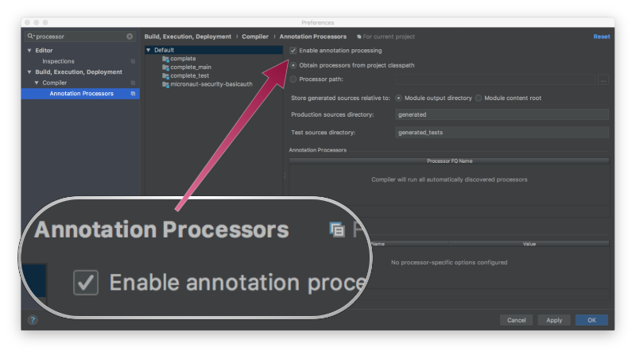

# Micronaut Http Client Sample
> Code from: https://guides.micronaut.io/latest/micronaut-http-client-gradle-kotlin.html

In this guide, we will create a Micronaut application written in Kotlin to consume the GitHub API with the Micronaut HTTP Client.

## Technologies :
- Kotlin
- Gradle
- Micronaut
- Micronaut Reactor
- Micronaut Http Client
- GraalVM

### Micronaut 3.1.1 Documentation

- [User Guide](https://docs.micronaut.io/3.1.1/guide/index.html)
- [API Reference](https://docs.micronaut.io/3.1.1/api/index.html)
- [Configuration Reference](https://docs.micronaut.io/3.1.1/guide/configurationreference.html)
- [Micronaut Guides](https://guides.micronaut.io/index.html)
---

### Feature reactor documentation

- [Micronaut Reactor documentation](https://micronaut-projects.github.io/micronaut-reactor/snapshot/guide/index.html)

### Feature http-client documentation

- [Micronaut HTTP Client documentation](https://docs.micronaut.io/latest/guide/index.html#httpClient)

## Intellij Configuration
Enable annotation processor configuration: 

## Generate a Micronaut Application Native Image with GraalVM

> Este build é extremamente pesado, recomendado ter um bom processador e memória disponível.
> Ao executá-lo deixe o mínimo de processos e aplicações rodando. Também é recomendável a
> instalação de um bom gerenciador de memória. Para o linux pode usar o ZRam.

1) Install GraalVM: `sdk install java 21.3.0.r11-grl`
2) Install native component: `gu install native-image`
3) Generate native image: `./gradlew nativeImage`
